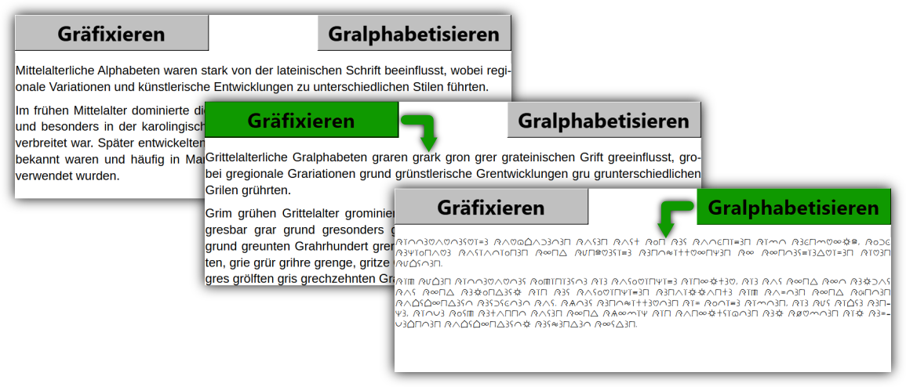

# Gralphabetisierer

Libre Office Writer Makros zur automatischen Umsetzung der Greifensteiner Sprache
- Gräfixieren: Ersetze die Angangskonsonanten eines Wortes mit "Gr"
- Gralphabetisieren: Transkription in das Greifensteiner Alphabet - das **_Gralphabet!_**

**!!! WICHTIG: Erlaube nur Makros in Libre Office, denen du wirklich vertraust !!!**

## Installation

1. Installiere [Libre Office](https://www.libreoffice.org/).
2. Installiere die Schriftart "Gralphabet" von der Datei "resources/Gralphabet-Font.ttf".
   Die Schriftart wurde von Helmfried, Burggraf der Herbstburg, erstellt.

### Makros in Libre Office aktivieren

**!!! WICHTIG: Erlaube nur Makros in Libre Office, denen du wirklich vertraust !!!**

1. Öffne Libre Office Writer und gehe ins Menü **Extras > Optionen**
2. Wähle **LibreOffice > Sicherheit** aus.
3. Klick die Schaltfläche "Makrosicherheit...".
3. Setze die Sicherheits-Stufe zu "Mittel".

Beim Öffnen einer Datei mit Makros wird nun immer gefragt, ob die Ausführung von Makros erlaubt werden soll oder nicht.

## Verwendung

**!!! WICHTIG: Erlaube nur Makros in Libre Office, denen du wirklich vertraust !!!**

1. Ersetze den Text in dem LO Writer Dokument "Gralphabetisierer.odt" mit deinem Text.
   Der gesamte Text in dem Dokument wird bearbeitet.
   (Der Beispieltext in dem Dokument wurde mittels ChatGPT generiert.)

2. Zum Ersetzen der Anfangskonsonanten aller Wörter mit "Gr" bzw. "gr", klick auf die Schaltfläche "Gräfixieren".
   
   *ODER*
   
   Führe das Makro "Graefixieren" aus:\
   **Extras > Makros > Makros ausführen ... > Gralphabetisierer.odt > Standard > Gralphabetisierer > Graefixieren**

3. Zum Transkribieren des Textes in das Gralphabet, klick auf die Schaltfläche "Gralphabetisieren"
   
   *ODER*
   
   Führe das Makro "Gralphabetisieren" aus: \
   **Extras > Makros > Makros ausführen ... > Gralphabetisierer.odt > Standard > Gralphabetisierer > Gralphabetisieren**

### Bekannte Einschränkungen: Gräfixieren

- Folgt der Punkt am Satzende keinem Buchstaben sondern einem Zeichen (inkl. Leerzeichen), wird dem Punkt ebenfalls ein "Gr" Gräfix vorangestellt.

  > Z.B. "Frankfurt (am Main)." wird zu "Grankfurt (gram Grain)Gr."
  
- Zeichen am Anfang eines Absatzes werden gelöscht.

  > Z.B. Guillements: "»Hallo, wie geht es dir?«" wird zu "Grallo, grie greht gres grir?«".
  
  Zeichen am Anfang eines Satzes innerhalb eines Absatzes sind nicht betroffen.
  
- Großbuchstaben innerhalb eines Wortes (z.B. ein Wort in NUR Großbuchstaben) sind nicht unterstützt.
  Sie erhalten den normalen Präfix "Gr".
  
  > Z.B. "NUR" wird zu "GrUR".
  
- Nicht ausgeschriebene Zahlen sind nicht unterstützt.

  > Z.B. "15 Äpfel" wird zu "Gr15 Gräpfel", aber "Fünfzehn Äpfel" wird zu "Grünfzehn Gräpfel".
  
- Abkürzungen sollten vermieden werden bzw. erst nach der Gräfixierung eingeführt werden.

  > Z.B. "Jhd." wird zu "Grjhd.", aber "Jahrhundert" wird zu "Grahrhundert" und kann dann als "Grhd." abgekürzt werden 
  
  (abgesehen davon wird in der Greifensteiner Sprache natürlich das Wort "Hundergrutzend" bevorzugt).
  
- Da jedes Wort durch das Makro einzeln bearbeitet wird, werden die standardmäßigen 100 Rückgänging-Machen Schritte in Libre Office sehr schnell überschritten.
   D.h. das Gräfixieren kann meist nicht vollständig rückgängig gemacht werden.
   Es wird empfohlen, den Originaltext zuvor separat abzuspeichern.
   
   Falls unbedingt nötig, kann die Anzahl an Rückgänging-Machen Schritte ("Undo Steps") in Libre Office Writer erhöht werden unter **Extras > Options > LibreOffice > Erweitert > Expertenoptionen > org.libreoffice.Office.Common > Undo > Undo**.
   Der Wert für "Steps" (Schritte) kann von 100 auf einen höheren Wert gesetzt werden.
   Dies erhöht natürlich den verwendeten Arbeitsspeicher.
   
- Wenn man den gesamten ersten Absatz löscht oder ersetzt, werden auch die Schaltflächen "Gräfixieren" und "Gralphabetisieren" gelöscht.
  Die zugehörigen Makros können allerdings immer noch durch das Makro Menü ausgeführt werden (s.o.).

### Bekannte Einschränkungen: Gralphabetisieren

- Ziffern sind in der Schriftart nicht implementirt.
  Es sollten ausgeschriebene Zahlen verwendet werden.
  
- Vorkommen von "S-CH" werden immer als "SCH" transkribiert. \
  
  > Z.B. "BISSCHEN" wird als "BIS-SCH-EN" transkribiert anstatt als "BISS-CH-EN".

- Bug: Zwischen Absätzen werden acht Leerzeilen engefügt.

## Ablauf der Gräfixierung

Die Gräfixierung eines Wortes erfolgt in den folgenden Schritten:

1. Finde den ersten Vokal in jedem Wort.
   Vokale sind definiert als a, e, i, o, u, ä, ö, ü und y (es geht hier um die Aussprache).
   Weiterhin werden Ziffern (0 bis 9) als Vokale behandelt, da sonst bei wiederholtem Gräfixieren allen Zahlen ein zusätzlicher Gräfix vorangestellt wird.
   
2. Ersetze alle Zeichen vor dem ersten Vokal mit
   - "Gr", falls das Wort groß geschrieben ist.
     Ein groß geschriebener Vokal am Wortanfang wird in einen Kleinbuchstaben umgewandelt.
   - "gr" falls das Wort klein geschrieben ist
   
3. Gibt es keinen Vokal in dem Wort, wird der erste Buchstabe des Wortes klein geschrieben und der ensprechende Suffix ("Gr"/"gr") dem Wort vorangestellt.
   
   > Z.B. "Hmmm" wird zu "Grhmmm".

## Ablauf der Gralphabetisierung

Die Gralphabetisierung erfolgt in den folgenden Schritten:

 1. Konvertiere den gesamten Text zu Großbuchstaben.
 2. Ersetze alle "GR" mit "g".
 3. Ersetze alle "ST" mit "t".
 4. Ersetze alle "SCH" mit "s".
 5. Ersetze alle "EI" mit "i".
 6. Ersetze alle "ẞ" mit "SS".
 7. Ersetze alle "AU" mit "a".
 8. Ersetze alle "EU" mit "e".
 9. Ersetze alle "CH" mit "c".
10. Änderung der Schriftart zu "Gralphabet".

## Referenzen für Makros in Libre Office
[LibreOffice Basic Help](https://help.libreoffice.org/latest/en-US/text/sbasic/shared/main0601.html?DbPAR=BASIC)

[Information and resources for LibreOffice macros](https://wiki.documentfoundation.org/Macros)

[LibreOffice 24.2 API Documentation](https://api.libreoffice.org/)

[LO SDK API Reference](https://api.libreoffice.org/docs/idl/ref/namespacecom_1_1sun_1_1star.html)

[Libre Office Basic examples](https://api.libreoffice.org/examples/examples.html#Basic_examples)

### Bearbeitung der Schaltflächen

1. Aktiviere den Entwurfsmodus im Menü **Formular > Entwurfsmodus**.
2. Zum Bearbeiten der Schaltfläche

   - Linksklick zur Positionierung.
   - Rechtsklick Auswahl von Optionen.
   
1. Deaktiviere den Entwurfsmodus im Menü **Formular > Entwurfsmodus**.